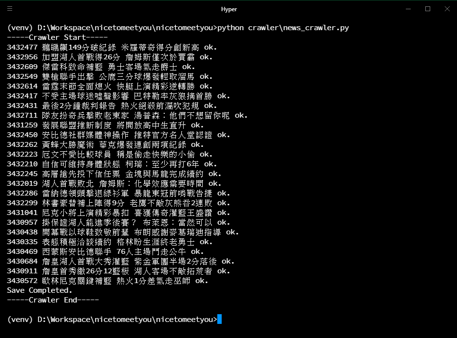
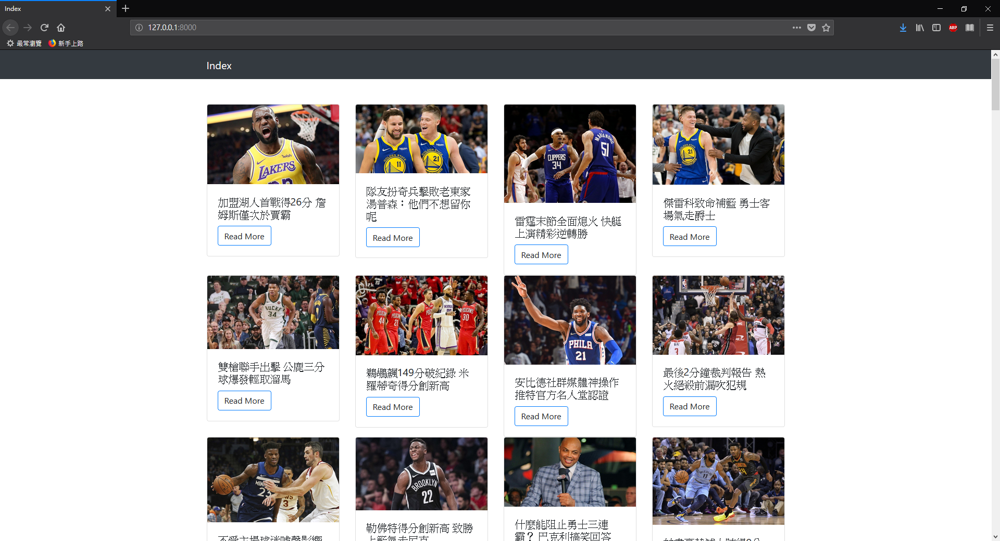

# nice to meet you
1. (**完成**) 抓取 https://nba.udn.com/nba/index?gr=www 中的焦點新聞。
2. (**完成**) 使用 [Django](https://www.djangoproject.com/) 設計恰當的 Model，并將所抓取新聞存儲至 DB。
3. (**完成**) 使用 [Django REST Framework](http://www.django-rest-framework.org/) 配合 AJAX 實現以下頁面：
	 * 焦點新聞列表
	 * 新聞詳情頁面
4. (**完成**) 以 Pull-Request 的方式將代碼提交。
	
## 進階要求
1. (**未完成**) 實現爬蟲自動定時抓取。

	1. 可使用 Python 的相關任務排程模組來執行爬蟲程式
		- [Celery](http://www.celeryproject.org/)
		- [Django Q](https://django-q.readthedocs.io/en/latest/)
	2. 利用作業系統的排程功能，例如 Linux 的 crontab
	3. 在爬蟲程式裡設定時間

2. (**未完成**) 每當抓取到新的新聞時立即通知頁面。

	可以在頁面的 script 裡寫個定時去後端確認資料的 function 在做進一步的畫面更新

3. (**未完成**) 将本 demo 部署至服务器并可正确运行。

## How to test

### Setup
Clone 這個 Repository 跟安裝相關模組

```
pip install -r requirements.txt
```

進入到 manage.py 的目錄下並初始化資料庫的設定

```
$ cd nicetomeetyou
$ python manage.py makemigrations
$ python manage.py migrate
```

新增一個 Super User

```
$ python manage.py createsuperuser
```

執行這個網站

```
python manage.py runserver
```

這時候的首頁應該什麼都沒有

### Crawler

開啟另一個終端機，一樣在 manage.py 的目錄

```
$ python crawler\news_crawler.py
```

以下是執行爬蟲的示意圖



執行完後應該就有資料了

### Open

在瀏覽器輸入 ```http://127.0.0.1:8000/``` 應該會看到以下的畫面


