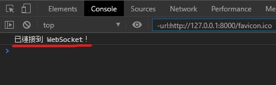
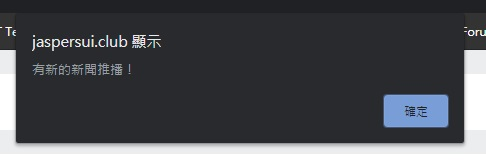

## 創順科技 面試測驗繳交 - 睢洋(suiyang03@gmail.com)

Demo link: [https://jaspersui.club/](https://jaspersui.club/)

測驗截止期限為 3/6 13:00，此次測驗共耗時約 16-20 小時，所有要求皆已完成。

非常感謝您撥冗查閱，以下會將各要求對應到專案的部份分開介紹，方便主管審核！

## 開發環境

```
// Linux (Python 3.5) Production
// scrapy-news\requirements_linux.txt
asyncio==3.4.3
channels==2.1.5
channels-redis==2.3.2
daphne==2.2.0
Django==2.1.7
djangorestframework==3.11.0
mysqlclient==1.4.6
uWSGI==2.0.18
Scrapy==2.0.0
scrapy-djangoitem==1.1.1
Twisted==19.10.0
```

```
// Windows 10 (Python 3.7) Local
// scrapy-news\requirements_windows.txt

channels==2.4.0
channels-redis==2.4.2
daphne==2.4.1
Django==3.0.3
djangorestframework==3.11.0
mysqlclient==1.4.6
Scrapy==2.0.0
scrapy-djangoitem==1.1.1
Twisted==19.10.0
```

## 基礎要求

#### 1. 抓取 https://nba.udn.com/nba/index?gr=www 中的焦點新聞。

   以 Scrapy 實作，主要實作檔案為 **news_spider.py**，
   
   爬取該頁面焦點新聞內的三個新聞，並將未在資料庫內的新聞以 News Model 塞入 News Table，
   
   有做 Null 以及 JavaScript 的檢查，若該新聞沒有在資料庫則進入解析及新增的 callback。
   
   路徑如下：

```    scrapy-news\ScrapyNews\mysite\newsbot\newsbot\spiders\news_spider.py```
   

#### 2. 使用 Django 設計恰當的 Model，并將所抓取新聞存儲至 DB。
    
   使用 MySQL 搭配 Django，主要使用到的 Model 為 News，
   
   實作檔案為 **models.py** 路徑如下：
   
```    scrapy-news\ScrapyNews\mysite\main\models.py```
   
   ```python
#main/models.py
#Line 114
   class News(models.Model):
        news_id = models.IntegerField(primary_key=True) #PK, INT
        title = models.CharField(max_length=255)        #標題, NVARCHAR(255)
        subtitle = models.CharField(max_length=255)     #副標, NVARCHAR(255) EX:報社/記者/即時報導
        context = models.TextField()                    #內容, TEXT
        post_url = models.CharField(max_length=255)     #連結, NVARCHAR(255)
        img_url = models.CharField(max_length=255)      #圖片連結, NVARCHAR(255)
        post_date = models.DateTimeField()              #刊登時間, DATETIME
        create_date = models.DateTimeField()            #創建時間, DATETIME

    class Meta:
        managed = False
        db_table = 'news'
   ```
   
   
#### 3. 使用 Django REST Framework 配合 AJAX 實現以下頁面：

#### (1) 焦點新聞列表

Demo Link: [焦點新聞列表](https://jaspersui.club/)

對應到的 Views.py Function 如下：

```python
#main/views.py
#Line 31
def Index(request):
    os_name = os.name #用來判斷目前是 Local 還是 Production
    return render(request, 'main/index.html', locals())
```

而 index.html 內使用 AJAX 去 Call ```NewsViewSet``` 內取得所有新聞的接口

再以 jQuery.prepend() 來將新聞物件動態新增到 Div 內。

##### 取得所有新聞的接口： ```/api/news/```


#### (2) 新聞詳情頁面

Demo Link: [新聞詳情頁面](https://jaspersui.club/news/85)

對應到的 Views.py Function 如下：

```python
#main/views.py
#Line 35
def NewsDetail(request):
    news_id = news_id
    return render(request, 'main/news-detail.html', locals())
```

而 news-detail.html 內使用 AJAX 去 Call ```NewsViewSet``` 內取得特定 ID 新聞的接口

再以 jQuery.append() 來將該新聞物件動態新增到各個對應的 Div 內。

##### 取得特定 ID 新聞的接口：```/api/news/<int:news_id>```

#### 4. 以 Pull-Request 的方式將代碼提交。

已完成。

---


## 進階要求
#### 1.  使用 Scrapy。
    ※ 如基本要求第一點，故暫略。
#### 2.  實現爬蟲自動定時抓取。
每 30 秒爬一次，主要實作檔案為 **scheduler.py**：
```python
# scrapy-news\ScrapyNews\mysite\newsbot\scheduler.py
# 用來30秒遍歷一次新聞網站的 Scheduler
import time
import os

while True:
    os.system("scrapy crawl news")
    time.sleep(30)
```
#### 3.  使用 Websocket 服務，抓取到新的新聞時立即通知前端頁面。
以 Channels 2 搭配 Daphne 實作，

客戶端進入網頁後會和主機 Handshake，

Handshake 完後加入 "**NEWS_STREAMING_GROUP**" 這個 Group 後完成 WebSocket Connect，

Connect 成功後瀏覽器開發者工具(F12) Console 即可看到成功訊息（如下圖）。




```Python
# main/consumers.py 
# Line 9

    # 客戶端連線至 WS
    async def connect(self):

        # 加入 NEWS_STREAMING_GROUP 群組
        await self.channel_layer.group_add("NEWS_STREAMING_GROUP", self.channel_name)

        await self.accept()
```


當 scheduler.py 每 30 秒爬一次爬到有新的新聞進來之後，

最後新的 News DjangoItem 就會進到 pipelines.py 的 process_item(self, item, spider)，

接著先將 News DjangoItem 儲存到 DB 內，再對 "**NEWS_STREAMING_GROUP**" 廣播 JSON

```JSON
// JSON
{
    "type": "add_news", // add_news為 main/consumers.py 內對有新 News 的推播函式
    "text_data": data
}
```

```Python
# newsbot/newsbot/pipelines.py 
# Line 21
def process_item(self, item, spider):

        #儲存 News DjangoItem
        item.save()

        # 初始化 channel layer
        channel_layer = get_channel_layer()

        # 取得當前處理的 news <Model Object>
        news = News.objects.get(post_url=item['post_url'])
        
        # 新建一個 Async loop，避免交互影響
        loop = asyncio.get_event_loop()

        # 發送 news json 給該 Group， Group name 已固定為 NEWS_STREAMING_GROUP
        loop.create_task(channel_layer.group_send("NEWS_STREAMING_GROUP", {"type": "add_news", "text_data": json.dumps(model_to_dict(news), default=default)}))
        return item
```

接著 consumers.py 即會將該 JSON 處理後推送給客戶端

```Python
# main/consumers.py
# Line 26
# 推送有新的新聞的訊息
    async def add_news(self, text_data):

        await self.send(text_data=json.dumps({
            'model': text_data
        }))
```

客戶端的 WebSocket 收到推播後，就會馬上彈出提醒視窗（如下圖）



並以 jQuery.prepend() 來將新聞物件動態新增到 Div 內。

**【重要】
 若是需要馬上測試該功能不想等待新的新聞被發出，可以先透過 POST 以下接口將一則最
 新的新聞從資料庫刪除，並在 scheduler.py 執行下一次的 scrapy crawl 之前重新整理頁
 面，就可以把被刪除的那個新聞視作為新的新聞，等到下一次爬蟲執行後就會收到 WebSocket 推播。**
 
 以下為影片示範，步驟分別為：
 
 ```沒有新的新聞(剩餘3個)→POST API 刪除新聞(剩餘2個)→收到推播(剩餘3個)→進入該新聞詳情頁面```
 
 [](http://www.youtube.com/watch?v=nEEBmZ6kbC8 "WebSocket Delete API Showcase")
 

##### 刪除最新新聞接口 (POST)：```https://jaspersui.club/api/news/delete-the-latest-news/```

#### 4.  将本 demo 部署至服务器并可正确运行。

架設在 DigitalOcean 內，機器 Spec 如下：
```
OS    : Ubuntu 16.04.6 (LTS) x64
CPU   : 1 Shared vCPU
MEMORY: 1  GB
SSD   : 25 GB
```

以 Django + DRF + Scrapy + Nginx + uWSGI + Channels (Daphne) 來實作這次專案，

搭配 CloudFlare 來作 CDN。

#### 5.  所實現新聞列表 API 可承受 100 QPS 的壓力測試。

以 Siege 來進行壓力測試取得所有新聞的接口。

> siege -c 500 -r 10 "https://jaspersui.club/api/news/"

結果如下圖，TPS 為 108.96，代表 QPS > 108.96(TPS) > 100。

.jpg)