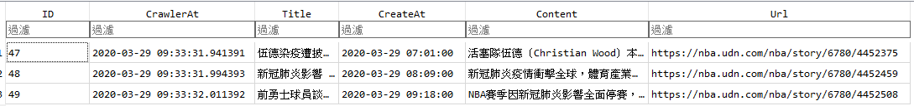
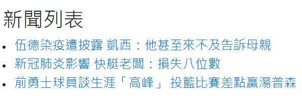
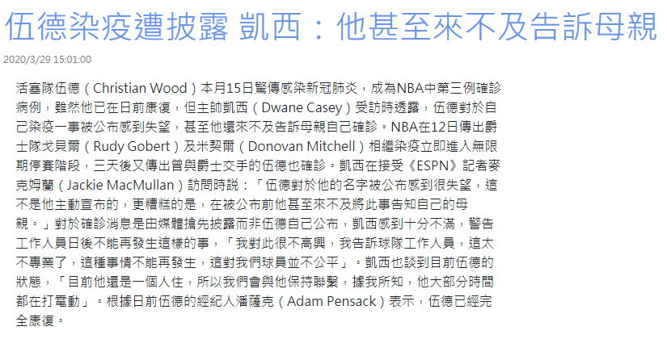
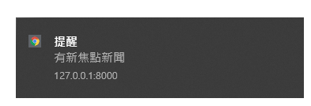
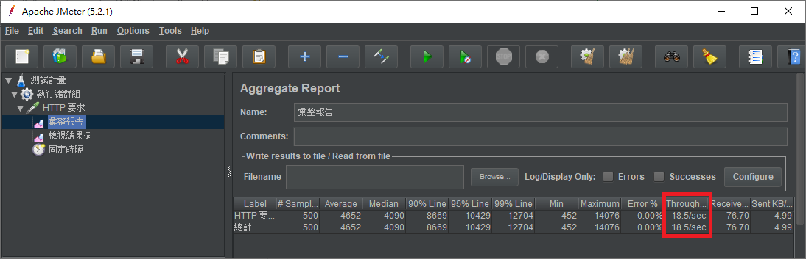
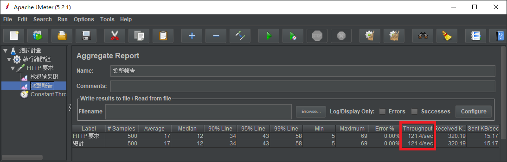

# 創順科技 面試測驗

Demo: [連結](https://my-nba-news.herokuapp.com/)(部署在heroku)

## 基本要求
1. 抓取 https://nba.udn.com/nba/index?gr=www 中的焦點新聞。

以Scrapy實作，實作檔案```MySite/SpiderBot/SpiderBotspiders/NBASpider.py```

2. 使用 [Django](https://www.djangoproject.com/) 設計恰當的 Model，并將所抓取新聞存儲至 DB。

使用SQLite搭配Django，使用的model為```MySite/api/model.py```
僅會儲存尚未儲存過的新聞
```Python
#api/models.py
#line 5
class News(models.Model):
    ID = models.AutoField(primary_key=True) #PK
    CrawlerAt = models.DateTimeField(auto_now=True) #新聞爬取時間
    Title = models.CharField(max_length = 100) #新聞標題
    CreateAt = models.DateTimeField() #新聞發布時間
    Content = models.CharField(max_length = 1000) #新聞內容
    Url = models.CharField(max_length = 1000) #原始連結
```


3. 使用 [Django REST Framework](http://www.django-rest-framework.org/) 配合 AJAX 實現以下頁面：

(1)焦點新聞列表

如Demo連結，實作檔案```MySite/api/templates/list.html```


```javascript
//list.html
//line 31
function GetNewsList(){
	const xhr = new XMLHttpRequest();
	xhr.open('GET', '/api/news', true);
	xhr.send();
	xhr.onreadystatechange = function() {
		if (this.readyState === 4 && this.status === 200) {
			let jsonData = JSON.parse(this.responseText);
			for(var item of jsonData){
				id = item['ID']
				title = item['Title']
				NewsListAdd(id, title)
			}
		}
	}
}
```


(2)新聞詳情頁面

如Demo連結，實作檔案```MySite/api/templates/news.html```


```javascript
//news.html
//line 27
var LocationUrl = window.location.href.split('/')
var NewsID = LocationUrl[LocationUrl.length - 1]
const xhr = new XMLHttpRequest();
xhr.open('GET', '/api/news/' + NewsID, true);
xhr.send();
xhr.onreadystatechange = function() {
	if (this.readyState === 4 && this.status === 200) {
    let jsonData = JSON.parse(this.responseText);
    ChangeNews(jsonData['Title'], jsonData['CreateAt'], jsonData['Content'])
	}
}
```

4. 以 Pull-Request 的方式將代碼提交。

已提交

## 進階要求
1. 使用 Scrapy。

如基本要求第一點

2. 實現爬蟲自動定時抓取。

實作檔案```MySite/SpiderBot/main.py```
使用方式```python main.py --freq 間隔秒數```
```python
#main.py
#line 7
def Job(frequence):
    Args = ["scrapy", "crawl", 'NBANews']
    while True:
        p = Process(target=cmdline.execute, args=(Args,))
        p.start()
        p.join()
        print('完成爬蟲')
        print(f'等待: {frequence} 秒')
        time.sleep(int(frequence))
```

3. 使用 Websocket 服務，抓取到新的新聞時立即通知前端頁面。

使用channels搭配channels-redis

由前端與後端Handshake後加入Group

前端console會顯示連接成功


有新的焦點新聞時，會由後端廣播至該Group所有前端

前端接收到通知後會顯示Windows Notify並重新撈取api



實作檔案

```MySite/api/templates/list.html```

```MySite/api/consumers.py```

```MySite/SpiderBot/SpiderBot/pipelines.py```
```js
//list.html
//line 83
BroadcastSocket.onmessage = function(e){
	var data = JSON.parse(e.data);
	var message = data['message'];
	var Type = message['type']
	switch (Type){
		case 'Broadcast':{
			document.getElementById('news').innerHTML = '' //清空列表
			Notify('有新焦點新聞') //Windows通知
			GetNewsList() //重新撈取api
			break;
		}
	}
}
```
4. 将本 demo 部署至服务器并可正确运行。

以docker部署至heroku，如Demo連結

5. 所實現新聞列表 API 可承受 100 QPS 的壓力測試。

使用JMeter測試 1秒內100個請求，loop 5 次共500次請求

因heroku使用免費的方案，固平均每秒回應的承載量較低



另外有測試local，平均每秒回應的承載量較高


