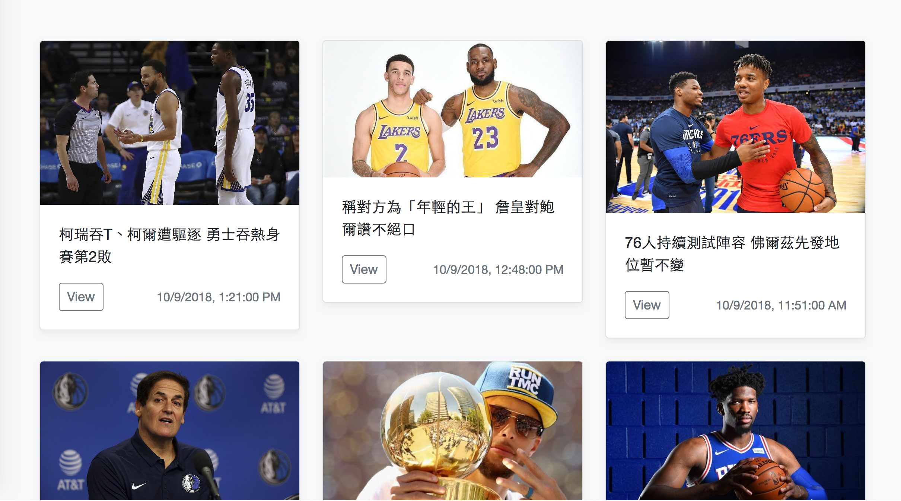

# nice to meet you
1. 抓取 https://nba.udn.com/nba/index?gr=www 中的焦點新聞。
    -> **完成**
2. 使用 [Django](https://www.djangoproject.com/) 設計恰當的 Model，并將所抓取新聞存儲至 DB。
    -> **完成**
3. 使用 [Django REST Framework](http://www.django-rest-framework.org/) 配合 AJAX 實現以下頁面：
	 * 焦點新聞列表
	  -> **完成**
	 * 新聞詳情頁面
	  -> **完成**
4. 以 Pull-Request 的方式將代碼提交。
    -> **完成**
    
## 進階要求
1. 實現爬蟲自動定時抓取。
    -> **完成**，使用django_q，每分鐘爬一次
2. 每當抓取到新的新聞時立即通知頁面。
    -> **未實作**，可以用 ajax polling 或是 websocket
3. 将本 demo 部署至服务器并可正确运行。
    -> **完成**，部署至Heroku

## Deployed Website Demo
https://newsfeed-wlku.herokuapp.com/index/

## Screen Shot

